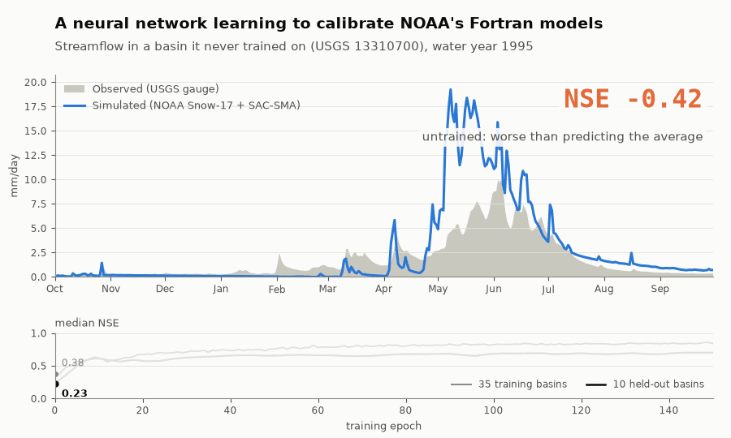
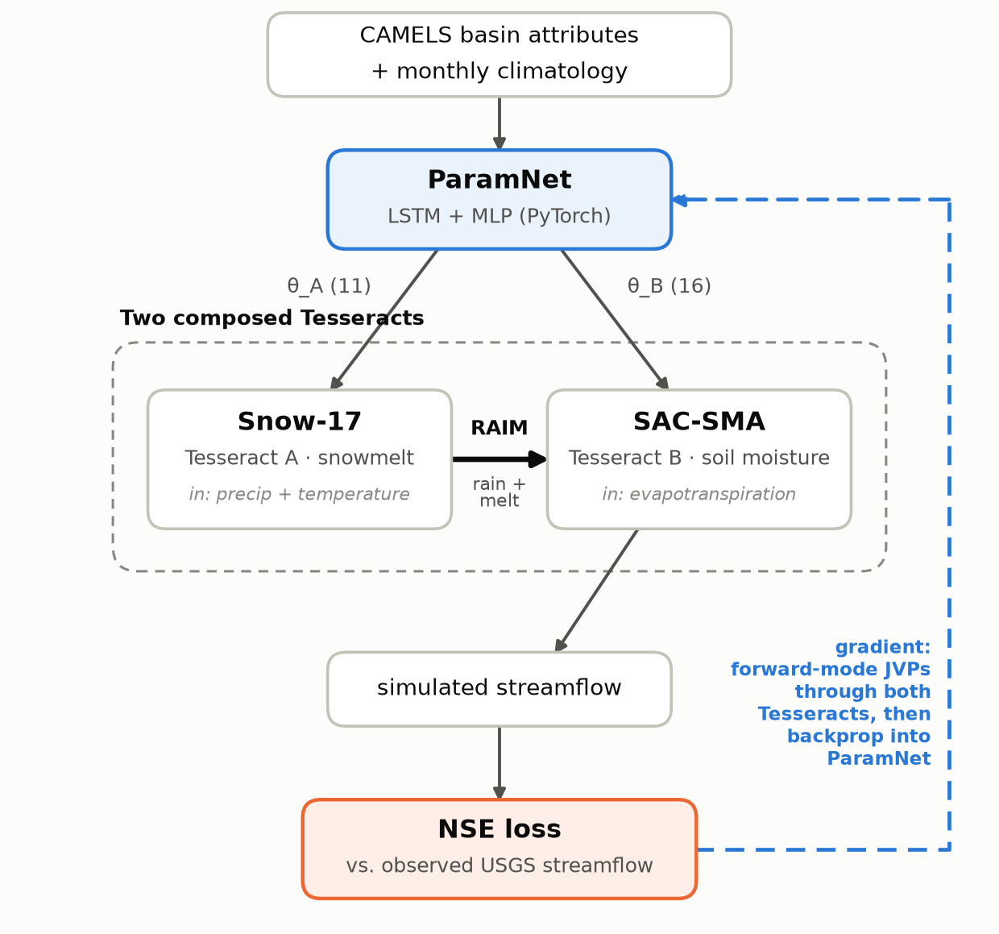
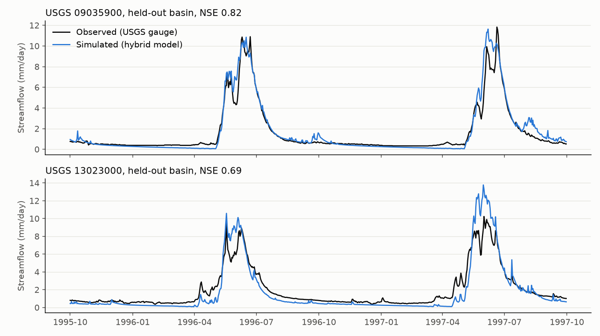

# δSnowSac


A neural network that learns to calibrate NOAA's operational snowmelt and soil-moisture models across many river basins at once, including ones it has never seen, while leaving NOAA's original Fortran code untouched.

Every day, NOAA forecasts river flow across the U.S. using two models written in
the 1970s: one for snowmelt, one for soil moisture. Before these models can be
used on a river, hydrologists usually have to tune these models with respect to each of the basins, creating a need for workflows that enable automated calibrations across multiple basins.

Machine learning has already shown potential to learn calibration across many basins at once. However, pure data driven models (like rainfall-runoff LSTMs) don't expose familiar hydrologic states or parameters that forecasters use for diagnosis and turn the problem into a typical ML black box. Another class of models called the differentiable hydrological models provide a better alternative by having a neural network learn parameters for physics model, and optimize end-to-end based on final loss function. However, this requires rewriting the physics model in a framework like Jax or PyTorch. I didn't do this.  

By leveraging Tesseract, the original Fortran NOAA models (Snow-17 and
SAC-SMA) that run in production are left untouched, and the neural network
is trained *through* them by gradient descent. What the network learns are
the parameters of the real operational models: melt rates, snowfall
correction, soil-water storage capacities, drainage rates, among 27 in total.

Trained on 35 snowy basins and tested on 10 it never saw, the model reaches a
median NSE of 0.70 on the unseen basins (NSE: 1 = perfect, 0 = no better than
predicting average flow every day; ~0.7+ is usually considered usable).
A pure-ML LSTM does better on accuracy (0.795), but what you get in exchange
is a model a forecaster can actually open up: every prediction comes with
physical parameters and states (snowpack, soil moisture) that can be
inspected, audited, and compared against how NOAA already calibrates these
basins.



*The network learning to calibrate NOAA's Fortran models, shown on a
basin it never trained on. Every frame is real model output from a
saved checkpoint, run through both unmodified Fortran models. The
untrained network roughly doubles the snowmelt peak (NSE -0.42, worse
than predicting the average flow). By the end of training it tracks
the observed flow (NSE +0.82). This basin was chosen because the
learning is most visible there, and it ends among the better fits. The
curves underneath are the honest summary: median NSE across all 10
held-out basins (0.23 untrained to 0.70) and across the 35 training
basins (0.38 to 0.84). Regenerate with
`results/animate_training.py`.*

## How it works

Snow-17 and SAC-SMA are compiled Fortran, so PyTorch's autograd cannot
see inside them and backpropagation stops at their boundary. This
project does not rewrite them. Each model is wrapped, unmodified, in
its own [Tesseract](https://docs.pasteurlabs.ai/projects/tesseract-core/latest/)
container. Each container exposes a forward run and a
finite-difference gradient, and
[`tesseract-torch`](https://github.com/pasteurlabs/tesseract-torch)
splices both into the PyTorch graph as ordinary differentiable layers.
A neural network can then learn the parameters of NOAA's operational
code directly, rather than the parameters of a reimplementation of it.



Solid arrows are the forward pass; the dashed arrow is the gradient. It
is computed by **forward-mode** automatic differentiation over the two
Tesseracts: a tangent is seeded on each parameter, Snow-17's
`jacobian_vector_product` turns it into a tangent on RAIM, and SAC-SMA's
`jacobian_vector_product` carries that tangent through to a tangent on
runoff. `tesseract-torch` chains the two endpoints automatically — the
RAIM tangent is handed from one container to the next as a single
vector, never as a matrix. Snow-17 produces RAIM (rain-plus-melt) — the
same coupling flux NOAA runs operationally into SAC-SMA — so the
container boundary sits at a real, existing operational seam.

## Why Tesseract

PyTorch's `.backward()` walks a recorded graph — Snow-17 and SAC-SMA
are compiled Fortran, so nothing is recorded and autodiff stops cold.
Each model is wrapped as its own Tesseract exposing `apply()` and both
finite-difference derivative endpoints, `jacobian_vector_product()`
(forward mode) and `vector_jacobian_product()` (reverse mode);
`tesseract-torch` splices both into the autograd graph as ordinary
differentiable layers. Two Tesseracts are composed here: NOAA maintains
Snow-17 and SAC-SMA as separate modules, and a standalone Snow-17
Tesseract is reusable with any downstream rainfall-runoff model, not
just this one.

<!-- **Why forward mode.** Snow-17's parameters reach the loss only through
RAIM, a full daily time series (~3,650 values). A reverse-mode
composition would ask SAC-SMA for `d(runoff)/d(RAIM)` — a dense
Jacobian against that intermediate flux, which finite differences can
only build one column per model run: thousands of runs. Forward mode
never forms it. With few inputs (27 parameters), one wide intermediate
flux, and a scalar loss, forward mode is the natural fit: its cost is
one pass per parameter (independent of series length), and Tesseract's
own forward-mode composition carries the RAIM tangent across the
container boundary. The gradient path is entirely Tesseract's
own machinery — there is no hand-written cross-container gradient code.
Forward mode differentiates the physics; the upstream network trains by
ordinary reverse-mode autograd, the two joined at the parameter vector
(see [src/coupling.py](src/coupling.py)).

**What it costs.** Each of the 27 passes re-runs both models from
scratch, so one gradient takes about 126 Fortran runs per basin, against
63 for the hand-written cross-container coupling this replaced (see
[notes/logs.md](notes/logs.md)). In practice training takes about 50 s
per epoch instead of about 5 s, most of it per-call Tesseract overhead
rather than Fortran. That is the price of the gradient crossing the
container boundary on Tesseract's own machinery rather than on custom
code; `test_coupled_gradient_rollout_budget` keeps it from growing. -->

Both containers are built and gradient-checked end-to-end — against
autograd ground truth and an independent brute-force check on cheap
stand-ins first (`tests/test_coupling_toy.py`), then against the real
Tesseracts (`tests/test_pipeline_hhwm8.py`, `tests/test_gradients.py`).
`tesseract build` runs in CI on every push, building both containers
from scratch and smoke-testing `apply()` against the built images (see
[.github/workflows/ci.yml](.github/workflows/ci.yml)).

## Results

*NSE (Nash-Sutcliffe Efficiency) is the standard skill metric for
streamflow models. 1.0 is a perfect match to observed flow. 0 means
the model is no better than guessing the historical average every day,
and a negative value is worse than that. What counts as good depends
on the domain and the basin, but 0.7 or higher is generally read as a
solid, usable model.*

`ParamNet` predicts all 27 learnable parameters (11 Snow-17 + 16
SAC-SMA) from each basin's static CAMELS attributes plus a climatology
sequence. It is trained end to end across 35 snow-dominated CAMELS
basins, and 10 more basins are held out (WY1991-1999). The held-out
basins test spatial generalization, which is the same problem as
predicting flow in ungauged basins.

| | median train NSE | median held-out NSE |
|---|---|---|
| epoch 1 | +0.38 | +0.28 |
| epoch 150 (final) | **+0.84** | **+0.70** |

Held-out skill rises quickly and then plateaus. Most of the held-out
gain comes in the first ~10 epochs, while training NSE keeps improving,
so the train/held-out gap widens to about 0.14 by epoch 150. Held-out
NSE never declines, so this is limited generalization from 35 basins
rather than overfitting. Full numbers and
reproduction commands are in [results/README.md](results/README.md).



*Daily streamflow in two held-out basins after training. The black
line is the USGS gauge and the blue line is the hybrid model. The top
basin is one of the best held-out fits (NSE 0.82). The bottom one is
near the median (NSE 0.69): it starts spring melt a little late and
overshoots the 1997 peak. Regenerate with `results/plot_hydrograph.py`.*

> These numbers come from the published run, trained with an earlier,
> hand-written cross-container coupling. Retrained from scratch with the
> current forward-mode code (same config and seed,
> `results/runs/model_9yrs_spatial_fwdmode/`), the model reaches median
> NSE 0.84 on training basins and 0.73 on held-out basins. Basin by basin,
> 5 of the 10 held-out basins improve and 5 get worse (mean held-out NSE
> 0.66 → 0.62), so this reproduces the result within run-to-run
> variation rather than improving on it. See
> [results/README.md](results/README.md).

For comparison, a properly engineered LSTM
([NeuralHydrology](https://github.com/neuralhydrology/neuralhydrology))
was trained and tested on the *exact same* 35/10 basin split:

| model | median held-out NSE |
|---|---|
| NeuralHydrology LSTM | **0.795** |
| this hybrid model | 0.70 |


Basin by basin, the gap is smaller than the medians suggest. The LSTM
leads on 6 of 10 basins and the hybrid model wins on 4. The gap ranges
from essentially tied (`09035900`, 0.822 vs. 0.809) to wide
(`11230500`, 0.408 vs. 0.827). Regenerate with
`results/plot_basin_comparison.py`.

On raw NSE, the hybrid model currently trails a competent LSTM (see
[results/external/neuralhydrology_lstm_pub/](results/external/neuralhydrology_lstm_pub/README.md)).
Beating an LSTM was never the goal. The goal was to learn the
parameters of NOAA's *actual* operational models end to end, without
rewriting the physics.

## Reproduce

Requires [uv](https://docs.astral.sh/uv/) and `gfortran`.

### 1. Build and test

```bash
git submodule update --init --recursive   # vendors NOAA-OWP/snow17 + sac-sma, pinned commits
make test                                  # creates .venv, builds Fortran shims, runs pytest
```

`make env` (run by `make test`) installs PyTorch's CUDA 12.6 build,
which works with NVIDIA driver 525 or newer. For other hardware, see
the comment at the top of the [Makefile](Makefile).

### 2. Get the CAMELS data (once)

About 3.4 GB. `make test` does not fetch it.

```bash
data/download_camels.sh
.venv/bin/python data/select_basins.py
.venv/bin/python data/build_attributes.py
.venv/bin/python data/build_pet.py
.venv/bin/python data/build_climatology.py
```

### 3. Train

```bash
.venv/bin/python src/train.py
```

The defaults reproduce [results/runs/model_9yrs_spatial/](results/runs/model_9yrs_spatial/):
35 training basins, 10 held-out basins, water years 1991–1999,
150 epochs. One epoch takes about a minute on a shared 104-core
server, so a full run takes about 2.5 hours. Use `train.n_epochs=5`
for a quick check that everything runs. Each epoch prints a line like
`epoch  12  train_nse=+0.41  test_nse=+0.38`, where `test_nse` is the
median NSE on the held-out basins.

Everything is written to `results/runs/hybrid_spatial_<timestamp>/`:

| File | Contents |
|---|---|
| `checkpoint.pt` | final network weights, the input to inference |
| `checkpoints/epoch_NNNN.pt` | weights and optimizer state every 10 epochs |
| `history.json` | per-epoch train/test NSE |
| `test_predictions.json` | simulated streamflow and NSE for each held-out basin |
| `config.yaml` | the full config the run used |

Common overrides (any config value can be set this way):

```bash
.venv/bin/python src/train.py device=cuda               # network + loss on GPU (default: cpu)
.venv/bin/python src/train.py seed=1 train.n_epochs=50 train.lr=1e-3
.venv/bin/python src/train.py output_dir=results/runs/my_run
.venv/bin/python src/train.py split=temporal            # same basins, later time window
```

For a long run on a remote machine, detach it and keep a log:

```bash
nohup .venv/bin/python src/train.py > train.log 2>&1 &
tail -f train.log
```

### 4. Run inference

Point `checkpoint=` at a `checkpoint.pt` from step 3 (or at a saved
one under `results/runs/`):

```bash
.venv/bin/python src/infer.py checkpoint=results/runs/hybrid_spatial_<timestamp>/checkpoint.pt
.venv/bin/python src/infer.py checkpoint=results/runs/model_9yrs_spatial/checkpoint.pt   # saved run
```

This runs all 45 basins (train and held-out), prints the median NSE,
and writes `predictions.json` (simulated streamflow in mm/day and NSE
for each basin) to `results/predictions/hybrid_spatial_<timestamp>/`.

Overrides work the same way. `device=cuda` works here too. To score a
trained model on a different period without retraining, change the
window:

```bash
.venv/bin/python src/infer.py checkpoint=<path> split.window.start=1999-10-01 split.window.end=2004-09-30
```

The `model` and `data` settings must match the ones the checkpoint was
trained with, which is the default unless you changed them when
training. The checkpoint stores only weights, not the architecture.

### Notes

Training and inference are driven by [Hydra](https://hydra.cc/)
configs under `configs/` (data / split / model / train), not hardcoded
constants. `device=cuda` (or `auto`) puts the parameter network and
loss on a GPU; the Fortran physics always runs on CPU, and
`src/coupling.py` moves tensors across that seam. The bottleneck is
the Fortran/Tesseract calls (finite-difference gradients), not model
size, so with the current small network a GPU does not speed training
up. See [results/README.md](results/README.md) for saved runs and
`results/compare_runs.py` for comparing them.

**Docker note:** day-to-day `apply()` / `jacobian_vector_product()`
development runs through `tesseract_core.Tesseract.from_tesseract_api()`
directly (no container needed); actual `tesseract build` runs in CI,
where Docker is available.

## Layout

```
external/snow17/, external/sac-sma/   git submodules, pinned commits (Apache-2.0, unmodified)
patches/                              disclosed, minimal, build-time-only patch to vendored source
fortran/                              bind(C) shims threading each model's state explicitly
tesseracts/snow17/, tesseracts/sacsma/  the two Tesseract containers: apply() + finite-difference JVP/VJP
src/coupling.py                       forward-mode bridge: physics differentiation -> network autograd
src/pipeline.py                       chains the two Tesseracts (apply_tesseract) into coupling.py
src/paramnet.py                       LSTM + MLP: attributes/climatology -> 27 bounded parameters
src/train.py, src/infer.py            Hydra-driven training / checkpoint scoring CLIs
configs/                              Hydra config groups (data/split/model/train)
data/                                 CAMELS download + basin selection + attribute/PET/climatology prep
tests/                                shim determinism/mass-balance, JVP/VJP checks, coupled-chain regression
notes/NOTES.md                        upstream Fortran findings, with a before/after proof
notes/logs.md                         design-decision rationale log
results/                              saved, seeded, reproducible run directories + external comparisons
```

## Status and what's next


- **Status:** research prototype.  The core pipeline works and is tested end to
  end. Development is to be continued.
- **Contributions:**  issues are very welcome (bug reports, questions, ideas,
  basins where it fails). If you'd like to contribute code, please open an
  issue first so we can agree on the approach; the codebase is still moving.
- **Contact:** [Kamlesh Sawadekar](https://www.linkedin.com/in/kamlesh-sawadekar/) on LinkedIn, or email kas7897 [at] psu [dot] edu
- **Citation:** if you use this work, please cite it using the "Cite this
  repository" button on GitHub (from `CITATION.cff`).

## Origin

This project started at the
[Pasteur Labs Tesseract Hackathon 2026](https://pasteurlabs.ai/tesseract-hackathon-2026/)
(Track 03: Hybrid ML + mechanistic models)
Received second place rank overall 🥈
<!-- TODO: replace the link once the announcement is live. -->

## License

Apache-2.0. See [LICENSE](LICENSE) and [NOTICE](NOTICE). Snow-17 is
vendored and linked against **unmodified**. SAC-SMA is vendored
unmodified as a pinned submodule. One disclosed, minimal patch is
applied to a **build-time copy only** to fix a confirmed upstream
defect; `external/sac-sma` itself is never modified. "Original work"
applies to this project, not its dependency tree: the shims, patches,
Tesseract wrappers, gradient endpoints, and training pipeline are
original work written during the hackathon period (Aug 3-31, 2026).
